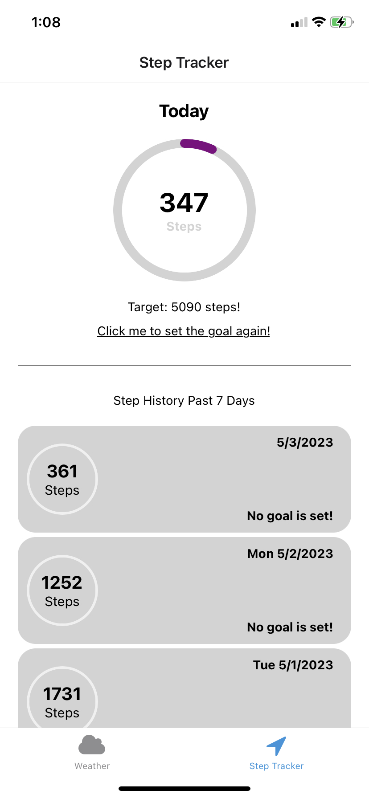

# Step Tracker App


> A simple application that support to connect apple health to track the daily steps and check the weather



## Requirements
> Xcode >= 14.0

## Notes
> Step tracking is not supported for android!

## Installation
```sh
yarn install
yarn ios
```